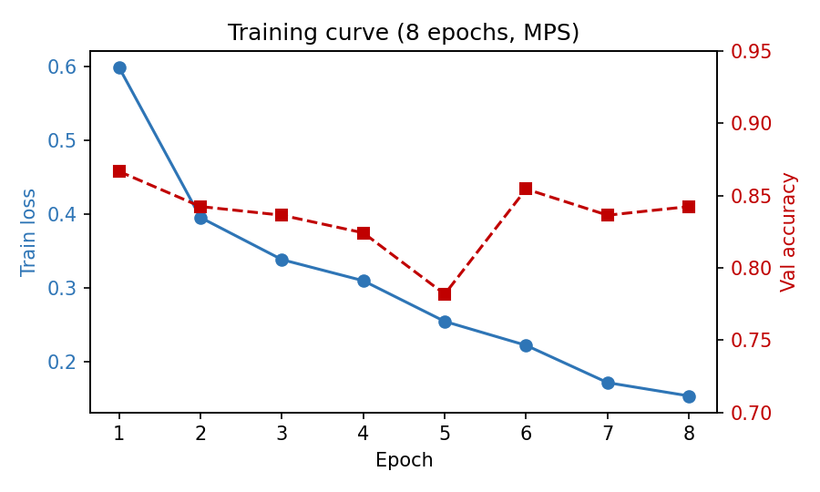
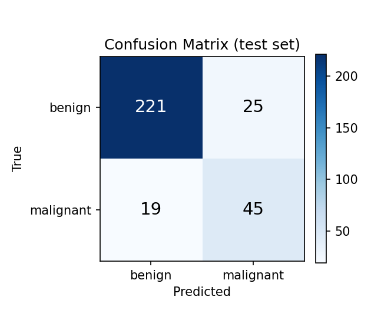

# 肺結節良／惡性分類 — NoduleMNIST3D × ViT (LoRA)

以 **Vision Transformer (ViT)** 搭配 **PEFT LoRA** 微調,對 **NoduleMNIST3D**（MedMNIST v2）3D 肺部 CT 結節做 **良性／惡性二分類**。整套流程可在一般筆電 GPU（Apple Silicon MPS）或 Colab GPU 上於數分鐘內完成。

## 成果

| 指標 | 測試集 |
|---|---|
| Accuracy | **0.8581** |
| AUC | **0.9223** |
| 可訓練參數 | 296,450 / 86M = **0.34%**（LoRA） |
| 訓練時間 | 8 epochs ≈ 7 分鐘（Mac MPS） |




## 方法概述

ViT 是 2D 模型,而資料是 28×28×28 的 3D 體積。本專案取每個體積的 **三個正交中心切片**（axial / coronal / sagittal）堆成 RGB 三通道,resize 到 224×224 後餵給 ImageNet-21k 預訓練的 `google/vit-base-patch16-224-in21k`,再用 LoRA 只微調注意力層的 query/value 與分類頭。

```
3D volume (28³) ──三正交切片──▶ RGB (3×224×224) ──▶ 預訓練 ViT-base ──LoRA──▶ benign / malignant
```

## 檔案

| 檔案 | 說明 |
|---|---|
| `NoduleMNIST3D_ViT_LoRA.ipynb` | 主程式:資料→前處理→模型→LoRA→訓練→評估→推論 |
| `肺結節分類_ViT_LoRA_報告.docx` | 書面報告 |
| `build_notebook.py` | 產生 notebook 的腳本 |
| `build_report.js` | 產生 Word 報告的腳本（docx-js） |
| `fig_training.png` / `fig_confusion.png` | 訓練曲線與混淆矩陣 |
| `results.json` | 測試集指標 |

## 環境與執行

```bash
pip install -r requirements.txt
jupyter notebook NoduleMNIST3D_ViT_LoRA.ipynb
```

裝置自動選擇:CUDA（Colab）> MPS（Mac）> CPU。`medmnist` 會自動下載資料集;ViT 權重由 HuggingFace 自動下載。

## 可延伸方向

- 改用較高解析度版本（`size=64` / `128`）
- 多切片或真正的 3D ViT
- Focal Loss / 過採樣改善惡性類別偵測
- 套用至其他 MedMNIST 3D 資料集（如 OrganMNIST3D）

## 參考

- MedMNIST v2 — https://medmnist.com/
- ViT — https://huggingface.co/google/vit-base-patch16-224-in21k
- LoRA / PEFT — https://github.com/huggingface/peft
